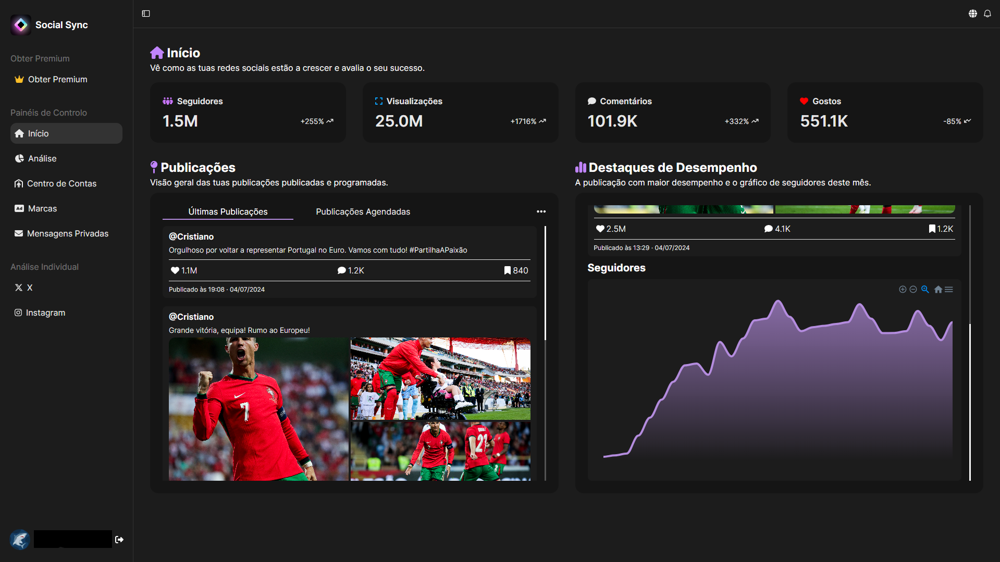
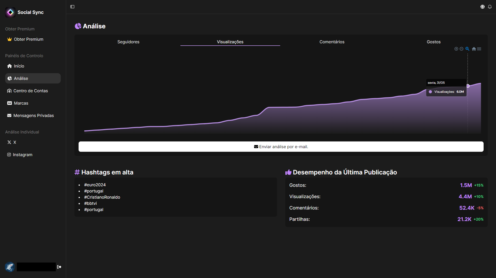

<h1 align="center">Social Sync</h1>

  Social Sync is a platform developed as part of my Final Professional Aptitude Project (called PAP in Portugal).

  It is designed to help influencers manage interactions across social media more efficiently — including organizing calendars, tracking engagement, scheduling posts, connecting socials, handling messages... in one place. Also it includes a translation system.
   
  I think this has some value that's why I am publishing it, and I think it's a good app idea that can lead to a business.
   
   
  Although I couldn't use the socials APIs (because they were paid 😡) I still made a demo using mock data, and used part of Twitter (X) API and Google Auth API.
   
   
  This was my first project using Next.js so it might be a little messed up but I tried my best.

<h4>
  ✅ Final grade: 20/20
</h4>
Feel free to explore, use, and modify the project.
If you use it or build upon it, please give proper credit.

### Technologies Used
* Typescript;
* React;
* MySQL;
* Framer Motion;
* Next Auth;
* Next.js;
* Nodemailer;
* Tailwind;
* Fontawesome Icons;
* Mui (Base);
* Sha256 Password Encryption;

## Preview

